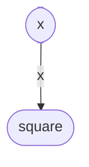

# TCC *vs* LCC

Explain under which circumstances *Tight Class Cohesion* (TCC) and *Loose Class Cohesion* (LCC) metrics produce the same value for a given Java class. Build an example of such as class and include the code below or find one example in an open-source project from Github and include the link to the class below. Could LCC be lower than TCC for any given class? Explain.

A refresher on TCC and LCC is available in the [course notes](https://oscarlvp.github.io/vandv-classes/#cohesion-graph).

## Answer

D’après le cours, on a les formules suivantes : 
Tight class cohesion TCC = number of direct connections / maximum number of connections
Loose class cohesion LCC = (number of direct connections + number of indirect connections) / maximum number of connections

TCC et LCC peuvent nous retourner la même valeur si le nombre de connexions indirectes est égal à zéro. Toute méthode a donc au moins un paramètre en commun avec chaque autre méthode. Cela implique qu'il n'y ait pas de getters, ou alors un seul, car les getters n'ont forcément pas de paramètre en commun. Dans notre exemple, nous avons créé une classe avec un unique getter et une seule méthode. La TCC est donc égale à 1/1 = 1 et la LCC vaut (1+0)/1 = 1.

~~~
public class xClass{
    private int x;

    public DataClass(int x) {
        this.x = x;
    }

    public int getX() {
        return x;
    }

  public int square(){
    return x * x;
  }
}
~~~

La LCC cne pourra jamais être plus fiable que la TCC car avec la formule énoncée au dessus, LCC >= TCC. En effet, le nombre de connexions indirectes ne peut pas être négatif et les deux valeurs ont le même nombre de connexions directs.
