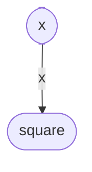

# TCC *vs* LCC

Explain under which circumstances *Tight Class Cohesion* (TCC) and *Loose Class Cohesion* (LCC) metrics produce the same value for a given Java class. Build an example of such as class and include the code below or find one example in an open-source project from Github and include the link to the class below. Could LCC be lower than TCC for any given class? Explain.

A refresher on TCC and LCC is available in the [course notes](https://oscarlvp.github.io/vandv-classes/#cohesion-graph).

## Answer

D’après le cours, on a les formules suivantes : 
Tight class cohesion TCC = number of direct connections / maximum number of connections
Loose class cohesion LCC = (number of direct connections + number of indirect connections) / maximum number of connections

TCC et LCC peuvent nous retourner la même valeur si le nombre de connexions indirectes est égal à zéro.

~~~
public class xClass{
    private int x;

    public DataClass(int x) {
        this.x = x;
    }

    public int getX() {
        return x;
    }

  public int square(){
    return x * x;
  }
}
~~~

